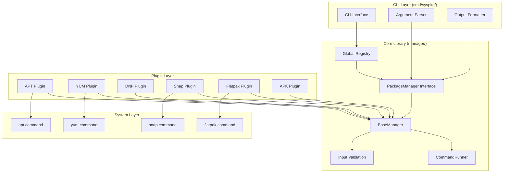
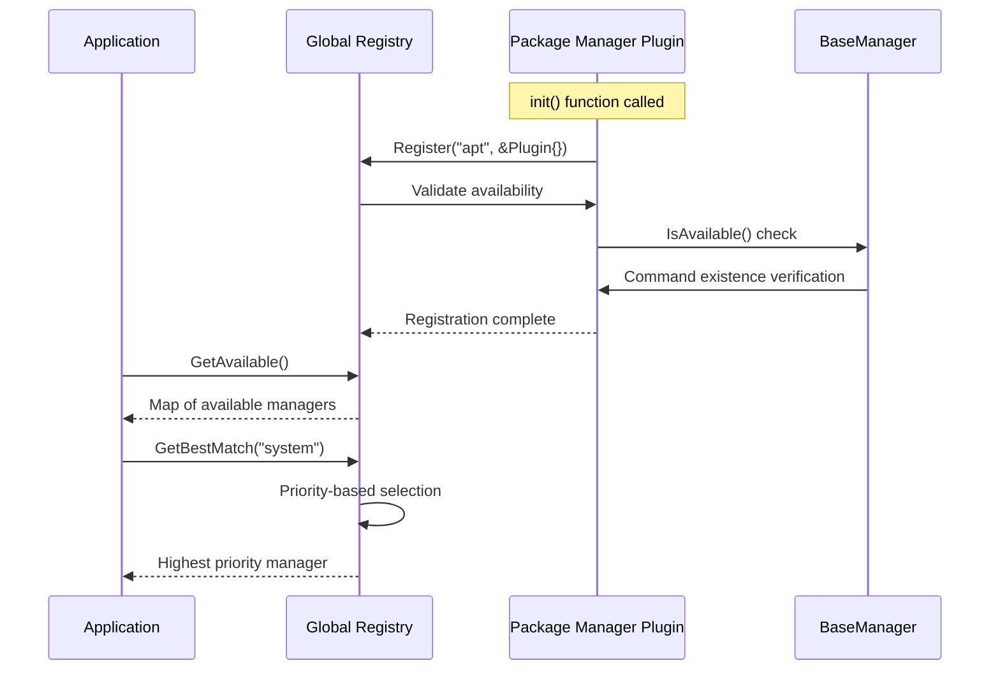

# Design Document

## Overview

SysPkg implements a unified package management system using a plugin-based architecture with a central registry pattern. The design prioritizes the Go module as the primary interface, with the CLI serving as a demonstration and user-facing wrapper. The system achieves consistency across different package managers through interface abstraction while maintaining full access to manager-specific capabilities.

The architecture follows the principle of "library-first with CLI wrapper" where all core functionality resides in the `manager/` package, and the CLI in `cmd/syspkg/` provides user-friendly access to these capabilities.

## Architecture

### High-Level Architecture



### Plugin Registration Flow



## Components and Interfaces

### Core PackageManager Interface

The central interface that all package managers must implement:

```go
type PackageManager interface {
    // Identity and availability
    GetName() string
    GetCategory() string
    IsAvailable() bool
    GetVersion() (string, error)

    // Core package operations
    Search(ctx context.Context, query []string, opts *Options) ([]PackageInfo, error)
    List(ctx context.Context, filter ListFilter, opts *Options) ([]PackageInfo, error)
    Install(ctx context.Context, packages []string, opts *Options) ([]PackageInfo, error)
    Remove(ctx context.Context, packages []string, opts *Options) ([]PackageInfo, error)
    GetInfo(ctx context.Context, packageName string, opts *Options) (PackageInfo, error)

    // System maintenance operations
    Refresh(ctx context.Context, opts *Options) error
    Upgrade(ctx context.Context, packages []string, opts *Options) ([]PackageInfo, error)
    Clean(ctx context.Context, opts *Options) error
    AutoRemove(ctx context.Context, opts *Options) ([]PackageInfo, error)

    // Advanced operations
    Verify(ctx context.Context, packages []string, opts *Options) ([]PackageInfo, error)
    Status(ctx context.Context, opts *Options) (ManagerStatus, error)
}
```

### BaseManager Implementation

Provides common functionality that plugins can embed:

```go
type BaseManager struct {
    name        string
    category    string
    priority    int
    runner      CommandRunner
    logger      Logger
}

// Common implementations that plugins inherit
func (b *BaseManager) GetName() string { return b.name }
func (b *BaseManager) GetCategory() string { return b.category }
func (b *BaseManager) GetRunner() CommandRunner { return b.runner }
func (b *BaseManager) GetLogger() Logger { return b.logger }

// Default implementations that plugins can override
func (b *BaseManager) Refresh(ctx context.Context, opts *Options) error
func (b *BaseManager) Clean(ctx context.Context, opts *Options) error
func (b *BaseManager) Status(ctx context.Context, opts *Options) (ManagerStatus, error)
```

### Registry Pattern

Central coordination point for all package managers:

```go
type Registry struct {
    managers map[string]PackageManager
    mutex    sync.RWMutex
    logger   Logger
}

// Registration and discovery
func (r *Registry) Register(name string, manager PackageManager) error
func (r *Registry) GetAvailable() map[string]PackageManager
func (r *Registry) GetBestMatch(category string) PackageManager

// Concurrent operations for performance
func (r *Registry) SearchAllConcurrent(ctx context.Context, query []string, opts *Options) map[string][]PackageInfo
func (r *Registry) InstallAllConcurrent(ctx context.Context, packages []string, opts *Options) map[string][]PackageInfo
func (r *Registry) ListInstalledAllConcurrent(ctx context.Context, opts *Options) map[string][]PackageInfo
```

### CommandRunner Abstraction

Enables testing and provides consistent command execution:

```go
type CommandRunner interface {
    Run(ctx context.Context, name string, args []string, opts *RunOptions) (CommandResult, error)
    RunVerbose(ctx context.Context, name string, args []string, opts *RunOptions) (CommandResult, error)
}

type CommandResult struct {
    Stdout   string
    Stderr   string
    ExitCode int
    Duration time.Duration
}

// Production implementation
type SystemCommandRunner struct{}

// Testing implementation
type MockCommandRunner struct {
    responses map[string]CommandResult
}
```

## Data Models

### PackageInfo Structure

Unified representation of package information across all managers:

```go
type PackageInfo struct {
    Name        string                 `json:"name"`
    Version     string                 `json:"version"`
    NewVersion  string                 `json:"new_version,omitempty"`
    Status      string                 `json:"status"`
    Description string                 `json:"description"`
    Category    string                 `json:"category"`
    Manager     string                 `json:"manager"`
    Metadata    map[string]interface{} `json:"metadata,omitempty"`
}
```

The `Metadata` field provides flexibility for manager-specific information:
- APT: `{"arch": "amd64", "section": "editors", "priority": "optional"}`
- YUM: `{"epoch": "1", "release": "el8", "repo": "base"}`
- Snap: `{"channel": "stable", "confinement": "strict", "publisher": "canonical"}`
- Flatpak: `{"runtime": "org.gnome.Platform", "branch": "44", "origin": "flathub"}`

### Options and Configuration

```go
type Options struct {
    DryRun     bool
    Verbose    bool
    Quiet      bool
    AssumeYes  bool
    ShowStatus bool
    Timeout    time.Duration
}

type ManagerStatus struct {
    Available       bool              `json:"available"`
    Healthy         bool              `json:"healthy"`
    Version         string            `json:"version"`
    LastRefresh     time.Time         `json:"last_refresh"`
    CacheSize       int64             `json:"cache_size"`
    PackageCount    int               `json:"package_count"`
    InstalledCount  int               `json:"installed_count"`
    Issues          []string          `json:"issues"`
    Metadata        map[string]interface{} `json:"metadata"`
}
```

### Error Handling and Status Codes

```go
type ReturnStatus int

const (
    StatusSuccess         ReturnStatus = 0
    StatusGeneralError    ReturnStatus = 1
    StatusUsageError      ReturnStatus = 2
    StatusPermissionError ReturnStatus = 77
    StatusUnavailable     ReturnStatus = 69
    StatusNetworkError    ReturnStatus = 5  // Future enhancement
    StatusSpaceError      ReturnStatus = 6  // Future enhancement
    StatusLockError       ReturnStatus = 7  // Future enhancement
)

func WrapReturn(exitCode int, stderr string, manager string) ReturnStatus {
    // Manager-specific exit code mapping with pattern detection
    // Future: Add regex pattern detection for enhanced error classification
}
```

## Error Handling

### Multi-Layer Error Strategy

1. **Input Validation Layer**: Prevent invalid inputs from reaching system commands
2. **Command Execution Layer**: Handle system command failures and timeouts
3. **Result Processing Layer**: Parse and classify errors from package manager outputs
4. **Status Mapping Layer**: Convert manager-specific errors to unified status codes

### Security Validation

```go
func ValidatePackageNames(packages []string) error {
    for _, pkg := range packages {
        if !isValidPackageName(pkg) {
            return fmt.Errorf("invalid package name: %s", pkg)
        }
    }
    return nil
}

func isValidPackageName(name string) bool {
    // Regex validation to prevent command injection
    // Allow alphanumeric, hyphens, underscores, dots, plus signs
    validPattern := regexp.MustCompile(`^[a-zA-Z0-9\-_.+]+$`)
    return validPattern.MatchString(name) && len(name) > 0 && len(name) < 256
}
```

### Concurrent Error Handling

```go
func (r *Registry) InstallAllConcurrent(ctx context.Context, packages []string, opts *Options) map[string][]PackageInfo {
    results := make(map[string][]PackageInfo)
    var wg sync.WaitGroup
    var mutex sync.Mutex

    for name, manager := range r.GetAvailable() {
        wg.Add(1)
        go func(name string, manager PackageManager) {
            defer wg.Done()

            packages, err := manager.Install(ctx, packages, opts)

            mutex.Lock()
            if err != nil {
                r.logger.Printf("Install failed for %s: %v", name, err)
                results[name] = []PackageInfo{} // Empty result, but manager attempted
            } else {
                results[name] = packages
            }
            mutex.Unlock()
        }(name, manager)
    }

    wg.Wait()
    return results
}
```

## Testing Strategy

### Three-Tier Testing Architecture

1. **Unit Tests**: Fast, isolated tests using authentic fixtures
2. **Integration Tests**: Docker-based tests with real package managers
3. **System Tests**: Full end-to-end testing in CI environments

### Fixture-Based Testing

```go
func TestAPTSearch(t *testing.T) {
    // Load authentic fixture from real apt command
    fixture := testutil.LoadFixture(t, "apt/search-vim-ubuntu2204.txt")

    // Test parser with real data
    packages := parseSearchOutput(fixture)

    assert.Equal(t, 183, len(packages))
    assert.Equal(t, "vim", packages[0].Name)
    assert.Equal(t, "apt", packages[0].Manager)
}
```

### Docker Integration Testing

```bash
# Safe testing environment for package operations
make test-docker-ubuntu    # APT testing in Ubuntu container
make test-docker-rocky     # YUM testing in Rocky Linux container
make test-docker-alpine    # APK testing in Alpine container
```

### MockCommandRunner for Unit Tests

```go
func TestInstallDryRun(t *testing.T) {
    mockRunner := &MockCommandRunner{
        responses: map[string]CommandResult{
            "apt install --dry-run vim": {
                Stdout:   "Reading package lists...\nWould install vim",
                ExitCode: 0,
            },
        },
    }

    manager := &APTPlugin{
        BaseManager: BaseManager{runner: mockRunner},
    }

    packages, err := manager.Install(ctx, []string{"vim"}, &Options{DryRun: true})
    assert.NoError(t, err)
    assert.Equal(t, "vim", packages[0].Name)
}
```

## Performance Considerations

### Concurrent Operations Design

- **Thread Safety**: Registry uses `sync.RWMutex` for safe concurrent access
- **Performance Gain**: 3x improvement through parallel execution across managers
- **Resource Management**: Goroutine pools prevent resource exhaustion
- **Context Propagation**: Proper timeout and cancellation support

### Memory Management

- **Lazy Loading**: Package managers only loaded when first accessed
- **Efficient Parsing**: Stream-based parsing for large package lists
- **Result Pooling**: Reuse data structures to reduce garbage collection
- **Fixture Caching**: Cache parsed fixtures to avoid repeated file I/O

### Startup Performance

- **Fast Registration**: Plugin registration completes in <50ms
- **Availability Checking**: Concurrent availability checks during startup
- **Minimal Dependencies**: Core library has minimal external dependencies
- **Command Caching**: Cache command availability checks

## CLI Integration Design

### Command Structure

```bash
syspkg <command> [options] [packages...]

Commands:
  search <query>        # Search for packages
  list [filter]         # List packages (installed, upgradable, all)
  install <packages>    # Install packages
  remove <packages>     # Remove packages
  info <package>        # Show package information
  update               # Update package lists
  upgrade [packages]    # Upgrade packages
  clean                # Clean package cache
  autoremove           # Remove orphaned packages
  verify <packages>    # Verify package integrity
  status               # Show package manager status
  managers             # List available package managers
```

### Output Format Design

```go
type OutputFormatter interface {
    FormatPackages(packages []PackageInfo, manager string) error
    FormatError(err error, manager string) error
    FormatStatus(status ManagerStatus, manager string) error
}

// Human-readable format
type HumanFormatter struct{}

// JSON format for programmatic use
type JSONFormatter struct{}

// Quiet format for pipeline processing
type QuietFormatter struct{} // Tab-separated values
```

### CLI-Specific Features

- **Pipeline Support**: Read package names from stdin using `-`
- **Safety Prompts**: Confirmation for destructive operations
- **Progress Indicators**: Real-time feedback for long operations
- **Error Recovery**: Graceful handling of partial failures
- **Shell Completion**: Bash/Zsh completion for commands and package names

## Security Design

### Input Validation Pipeline

1. **Package Name Validation**: Regex-based validation preventing injection
2. **Command Construction**: Parameterized command building
3. **Privilege Checking**: Clear indication of required permissions
4. **Timeout Enforcement**: Context-based operation timeouts

### Command Injection Prevention

```go
func (b *BaseManager) buildCommand(operation string, packages []string) ([]string, error) {
    // Validate all inputs before command construction
    if err := ValidatePackageNames(packages); err != nil {
        return nil, err
    }

    // Build command with validated parameters
    args := []string{operation}
    args = append(args, packages...)

    return args, nil
}
```

### Privilege Management

- **No Privilege Escalation**: System never attempts to gain privileges
- **Clear Error Messages**: Inform users when elevated privileges are needed
- **Safe Defaults**: Operations default to safe, non-destructive modes
- **Audit Trail**: Comprehensive logging of all operations

## Integration Points

### Go Library Integration

```go
// Simple single-manager usage
manager := registry.GetBestMatch("system")
packages, err := manager.Search(ctx, []string{"vim"}, opts)

// Multi-manager concurrent usage
registry := manager.GetGlobalRegistry()
results := registry.SearchAllConcurrent(ctx, []string{"vim"}, opts)

// Custom logging integration
manager.SetLogger(customLogger)
```

### Popular Framework Integration

- **slog Integration**: Native Go 1.21+ structured logging
- **logrus Integration**: Popular structured logging library
- **zap Integration**: High-performance logging library
- **Custom Loggers**: Flexible Logger interface for any logging system

### Container Integration

- **Docker Support**: Works in containerized environments
- **LXC Support**: Compatible with LXC containers
- **Kubernetes**: Suitable for Kubernetes-based package management
- **CI/CD Integration**: Designed for automated deployment pipelines

This design provides a robust, scalable, and secure foundation for unified package management while maintaining the flexibility to extend and customize the system for specific use cases.
