# Contributing to SysPkg

Thank you for your interest in contributing to SysPkg! This guide will help you understand our development workflow, testing strategy, and contribution process.

## 📖 Documentation Navigation

- **[README.md](README.md)** - Project overview and user guide
- **[CHANGELOG.md](CHANGELOG.md)** - Recent achievements and version history
- **[docs/ARCHITECTURE.md](docs/ARCHITECTURE.md)** - Technical design and interfaces
- **[testing/fixtures/README.md](testing/fixtures/README.md)** - Comprehensive fixture generation with Docker entrypoints
- **[testing/docker/README.md](testing/docker/README.md)** - Multi-OS testing infrastructure
- **[docs/EXIT_CODES.md](docs/EXIT_CODES.md)** - Package manager exit code behavior
- **[CLAUDE.md](CLAUDE.md)** - AI assistant development guidelines

## 📋 Quick Start for Contributors

### Prerequisites
- Go 1.23 or later
- Docker (for multi-OS testing)
- Git
- Make

### Basic Development Workflow
```bash
# 1. Clone and setup
git clone https://github.com/bluet/syspkg.git
cd syspkg

# 2. Install development tools
make install-tools

# 3. Install pre-commit hooks (recommended)
pre-commit install

# 4. Make your changes...

# 5. Test your changes
make test              # Quick testing for your OS
make check             # Code quality checks

# 6. Commit and push
git add .
git commit -m "your changes"
git push
```

## 🏗️ Development Environment

### Required Tools
```bash
# Install development dependencies
make install-tools        # Installs golangci-lint
go install golang.org/x/tools/cmd/goimports@latest

# Optional: Install pre-commit for automated quality checks
pip install pre-commit
# Note: pre-commit install was already done in step 3 of the basic workflow
```

### Technical Infrastructure

#### CI/CD Pipeline Status
Our continuous integration ensures code quality and cross-platform compatibility:

| Workflow | Status | Description |
| -------- | ------ | ----------- |
| **Test and Coverage** | ✅ | Go 1.23/1.24 testing with coverage reporting |
| **Lint and Format** | ✅ | golangci-lint, gofmt, go vet quality checks |
| **Build** | ✅ | Multi-version build verification |
| **Multi-OS Tests** | ✅ | Docker-based testing across Ubuntu, Rocky Linux, Alpine |
| **Release Binaries** | ✅ | Cross-platform binary releases |

#### Infrastructure Features
- ✅ **Pre-commit hooks**: Automated code quality and security checks
- ✅ **Go mod verification**: Dependency integrity validation
- ✅ **Multi-OS compatibility**: Docker testing with Go 1.23.4 across distributions
- ✅ **Fixture-based testing**: Real package manager output validation
- ✅ **Security scanning**: Input validation and command injection prevention
- ✅ **Cross-platform builds**: Support for multiple architectures and operating systems

### Project Structure
```
syspkg/
├── cmd/syspkg/           # CLI application
├── manager/              # Package manager implementations
│   ├── apt/             # APT (Ubuntu/Debian)
│   ├── yum/             # YUM (Rocky Linux/AlmaLinux)
│   ├── snap/            # Snap packages
│   └── flatpak/         # Flatpak packages
├── osinfo/              # OS detection utilities
├── testing/             # Testing infrastructure
│   ├── docker/          # Multi-OS Docker containers
│   ├── fixtures/        # Real command outputs for testing
│   └── testenv/         # Environment detection for tests
└── .github/workflows/   # CI/CD pipelines
```

## 🧪 Testing Strategy (Multi-Layered)

SysPkg uses a sophisticated **3-tier testing approach** to ensure compatibility across different operating systems:

### Testing Architecture Overview


### How Testing Works


## 🤔 **When Should I Run Which Tests?**

### **SIMPLE DECISION TREE:**

```
🤔 What are you working on?

├─ 📝 General code changes (core logic, CLI, docs)?
│  └─ ✅ `make test` (always works, 30 seconds)
│
├─ 🔧 Package manager code (APT, YUM, DNF, Snap)?
│  ├─ On the target OS? (Ubuntu for APT, Rocky for YUM)
│  │  └─ ✅ `make test` (tests real package manager)
│  └─ On different OS? (developing YUM on Ubuntu)
│     └─ 🐳 `make test-docker-rocky` (test on target OS)
│
├─ 🚀 Before major release or PR to main?
│  └─ 🐳 `make test-docker-all` (comprehensive validation)
│
└─ 🐛 CI failing mysteriously?
   └─ 🔍 `make test-integration` (debug environment issues)
```

## **PRACTICAL SCENARIOS:**

### ✅ **Daily Development (90% of cases)**
```bash
# You're working on: Core logic, CLI features, documentation, small fixes
make test              # ✅ ALWAYS use this first (works everywhere, fast)
make check             # ✅ Code quality before commit
```
**Why:** Fast feedback, tests what's available on your system

### 🎯 **Package Manager Development**

#### **Scenario A: Developing APT features on Ubuntu**
```bash
make test              # ✅ Tests real APT (you're on the right OS)
# Edit APT code...
make test              # ✅ Quick validation
```

#### **Scenario B: Developing YUM features on Ubuntu**
```bash
make test              # ✅ Tests core logic, skips YUM (expected)
# Edit YUM code...
make test-docker-rocky # 🐳 Test YUM on actual Rocky Linux
make test-docker-alma  # 🐳 Test YUM on actual AlmaLinux
```

#### **Scenario C: Developing DNF features anywhere**
```bash
make test              # ✅ Always run first
# Edit DNF code...
make test-docker-fedora # 🐳 Test DNF on actual Fedora
```

### 🚀 **Before Major Changes**
```bash
# You're about to: Create PR to main, tag a release, major refactoring
make test              # ✅ Quick sanity check
make test-docker-all   # 🐳 Comprehensive multi-OS validation (slower)
```
**Why:** Ensures no regressions across all supported platforms

### 🐛 **Debugging & Troubleshooting**
```bash
# CI is failing and you don't know why
make test-integration  # 🔍 Test real package manager commands
make test-docker-ubuntu # 🐳 Match CI environment exactly
```

## **TESTING TIERS EXPLAINED:**

### Tier 1: Standard Development Testing
**Command:** `make test`
**Speed:** ⚡ Fast (30 seconds)
**Use when:** Always, daily development, first thing to run

```bash
make test              # ✅ Smart testing - only tests available package managers
make test-unit         # ✅ Unit tests only (parser functions, OS detection)
make check             # ✅ Code quality (formatting, linting, vet)
```

**What it does:**
- Automatically detects your OS (Ubuntu, Rocky Linux, Fedora, etc.)
- Only tests package managers available on your system
- Skips tests for unavailable package managers (no false failures)

### Tier 2: Integration Testing
**Command:** `make test-integration`
**Speed:** 🐌 Medium (1-2 minutes)
**Use when:** Debugging CI issues, testing real package manager behavior

```bash
make test-integration  # Real package manager commands (limited operations)
```

**Build tags for selective testing:**
```bash
go test -tags=unit ./...              # Parser and core logic only
go test -tags=integration ./...       # Real command execution
go test -tags=system ./...            # Full package operations (requires privileges)
```

### Tier 3: Multi-OS Docker Testing
**Command:** `make test-docker-*`
**Speed:** 🐌 Slow (5-15 minutes)
**Use when:** Package manager development, pre-release validation

#### Docker Testing Mechanism


```bash
# Test specific OS/package manager combinations
make test-docker-ubuntu    # Test APT on Ubuntu
make test-docker-rocky     # Test YUM on Rocky Linux 8
make test-docker-alma      # Test YUM on AlmaLinux 8
# make test-docker-fedora  # DNF testing (implementation in progress)
# make test-docker-alpine  # APK testing (implementation in progress)

# Test all OS at once
make test-docker-all       # Parallel testing across all OS

# Generate fresh test fixtures using entrypoint approach
make test-fixtures         # All package managers with realistic scenarios
make test-fixtures-apt     # APT only - fast iteration
make test-fixtures-yum     # YUM only - Rocky Linux scenarios

# Cleanup Docker resources
make test-docker-clean     # Remove test containers and images
```

## **QUICK REFERENCE TABLE:**

| What You're Doing | Command | Speed | When |
|-------------------|---------|-------|------|
| **Any code change** | `make test` | ⚡ 30s | ✅ Always first |
| **Before commit** | `make check` | ⚡ 15s | ✅ Always |
| **APT development (on Ubuntu)** | `make test` | ⚡ 30s | ✅ Sufficient |
| **YUM development (any OS)** | `make test-docker-rocky` | 🐌 5min | 🎯 Required |
| **DNF development (any OS)** | `make test-docker-fedora` | 🐌 5min | 🎯 Required |
| **Before major PR** | `make test-docker-all` | 🐌 15min | 🚀 Recommended |
| **CI debugging** | `make test-integration` | 🐌 2min | 🐛 When needed |
| **Update fixtures** | `make test-fixtures` | 🐌 5min | 📁 Occasionally |
| **APT fixtures only** | `make test-fixtures-apt` | ⚡ 1min | 🎯 APT development |

## **GOLDEN RULE:**
**Always start with `make test` - it's smart enough to test what's available on your system and skip the rest!**

## 🔄 Development Workflows

### Workflow 1: General Development (Most Common)
```bash
# Working on core functionality, parser improvements, etc.
git checkout -b feature/my-feature
# ... make changes ...
make test                  # Quick validation
make check                 # Code quality
git commit -m "Add feature"
```

### Workflow 2: Package Manager Development
```bash
# Working on YUM, DNF, APT, etc.
git checkout -b fix/yum-parsing

# Test on target OS
make test-docker-rocky     # For YUM changes
make test-docker-fedora    # For DNF changes

# Generate updated fixtures if command output changes
make test-fixtures

git add . && git commit -m "Fix YUM parsing issue"
```

### Workflow 3: Cross-Platform Features
```bash
# Working on features that affect multiple OS
git checkout -b feature/new-package-manager

# Test comprehensive compatibility
make test-docker-all       # Ensure no regressions
make test                  # Local validation

git commit -m "Add new package manager support"
```

## 🏗️ Adding New Package Managers

### Step 1: Implement the Interface
```go
// manager/newpm/newpm.go
type PackageManager struct{}

func (pm *PackageManager) IsAvailable() bool { ... }
func (pm *PackageManager) Install(pkgs []string, opts *manager.Options) ([]manager.PackageInfo, error) { ... }
// ... implement all interface methods
```

### Step 2: Add Parser Functions
```go
// manager/newpm/utils.go
func ParseInstallOutput(output string, opts *manager.Options) []manager.PackageInfo { ... }
func ParseSearchOutput(output string, opts *manager.Options) []manager.PackageInfo { ... }
```

### Step 3: Create Tests
```go
// manager/newpm/newpm_test.go
func TestParseInstallOutput(t *testing.T) { ... }
func TestNewPMAvailability(t *testing.T) { ... }
```

### Step 4: Add Docker Support
```dockerfile
# testing/docker/newos.Dockerfile
FROM newos:latest
RUN newpm install -y curl git make golang
# ... setup container
```

### Step 5: Update Testing Matrix
```yaml
# testing/os-matrix.yaml
newos-family:
  distributions:
    - newos:1.0
  package_managers:
    newpm:
      available: true
      operations: [search, list, install, remove]
      test_priority: high
```

### Step 6: Add to CI/CD
```yaml
# .github/workflows/multi-os-test.yml
- os: newos
  pm: newpm
  dockerfile: newos.Dockerfile
  test_tags: "unit,integration,newpm"
```

### Step 7: Document Exit Codes
Create `manager/newpm/EXIT_CODES.md` documenting:
- Actual exit codes (not assumptions)
- Verified behavior through testing
- Special cases and edge behaviors
- Testing commands for verification

**Critical**: Never assume exit codes work like other package managers!

## 🧪 Testing Best Practices

### Core Testing Principles

1. **Fixtures are Real-World Data**
   - Fixtures contain full dumps of raw command outputs
   - They reflect real-world status and should be used in unit tests
   - Located in `testing/fixtures/` organized by package manager
   - Keep fixtures up-to-date with actual command outputs

2. **Docker for Safety and Isolation**
   - Use Docker for BOTH fixture generation AND actual testing
   - Protects your development system from package operations
   - Enables testing multiple OS/package manager combinations
   - Essential for testing destructive operations (install/remove)

3. **Testing Hierarchy**
   - **Unit Tests**: Use fixtures first, inline mocks for edge cases
   - **Integration Tests**: Run in Docker containers for safety
   - **System Tests**: Only in CI or dedicated test environments

4. **Fixture Usage in Tests**
   ```go
   // ✅ Good: Use real fixtures for realistic testing
   func TestSearchWithFixture(t *testing.T) {
       fixture := loadFixture(t, "apt/search-vim.txt")
       packages := parseSearchOutput(fixture)
       // Test with real-world data
   }

   // ✅ Also Good: Inline data for specific edge cases
   func TestSearchEdgeCase(t *testing.T) {
       output := "specific-edge-case-output"
       packages := parseSearchOutput(output)
       // Test specific behavior
   }
   ```

5. **Docker Testing Commands**
   ```bash
   # Generate fixtures safely
   make test-docker-ubuntu  # Capture APT outputs
   make test-docker-rocky   # Capture YUM outputs

   # Run tests in isolation
   make test-docker-all     # Full test suite in containers
   ```

### Writing Good Tests
```go
// ✅ Good: Environment-aware test
func TestYumOnlyOnRHEL(t *testing.T) {
    env, err := testenv.GetTestEnvironment()
    if err != nil {
        t.Fatalf("failed to get test environment: %v", err)
    }
    if skip, reason := env.ShouldSkipTest("yum"); skip {
        t.Skip(reason)
    }
    // ... test YUM functionality
}

// ❌ Bad: Assumes YUM is always available
func TestYum(t *testing.T) {
    yum := yum.PackageManager{}
    packages, _ := yum.ListInstalled() // Will fail on non-RHEL systems
}
```

### Three-Layer Testing Strategy

SysPkg follows modern testing best practices with a three-layer approach that allows testing almost every line of code without requiring system commands:

#### 1. **Unit Tests** (Pure Logic, No System Calls)
- **Purpose**: Test parsing functions and business logic using fixtures
- **Location**: `*_test.go` files (e.g., `behavior_test.go`)
- **Characteristics**:
  - Use real package manager output captured as fixtures
  - No system calls or external dependencies
  - Can run anywhere (CI, developer machines, any OS)
  - Fast execution (milliseconds)
- **Example**:
  ```go
  func TestParseFindOutput_BehaviorWithFixtures(t *testing.T) {
      fixture := loadFixture(t, "search-vim-rocky8.txt")
      pm := yum.NewPackageManager()
      packages := pm.ParseFindOutput(fixture, &manager.Options{})
      // Test parser behavior with real output
  }
  ```

#### 2. **Integration Tests** (Real Commands, OS-Aware)
- **Purpose**: Test full method implementations with actual package managers
- **Location**: `*_integration_test.go` files
- **Build Tag**: `// +build integration`
- **Characteristics**:
  - Execute real package manager commands
  - Automatically skip when package manager not available
  - Test the complete code path including enhancements
  - Medium execution time (seconds)
- **Example**:
  ```go
  func TestYUMOperations_Integration(t *testing.T) {
      env, _ := testenv.GetTestEnvironment()
      if skip, reason := env.ShouldSkipTest("yum"); skip {
          t.Skip(reason)
      }
      pm := &yum.PackageManager{}
      packages, err := pm.Find([]string{"bash"}, &manager.Options{})
      // Verify enhanced status detection works
  }
  ```

#### 3. **Mock Tests** (Full Logic, No System Calls)
- **Purpose**: Test complete method logic with dependency injection
- **Implementation**: CommandRunner interface (Issue #20) ✅
- **Characteristics**:
  - Test full business logic without system dependencies
  - Use MockCommandRunner for controlled responses
  - Can test error conditions and edge cases
  - Fast execution like unit tests
- **Example** (implemented in `yum_mock_test.go`):
  ```go
  func TestYUM_WithMockedCommands(t *testing.T) {
      mock := manager.NewMockCommandRunner()
      mock.AddCommand("yum", []string{"search", "vim"}, searchFixture)
      mock.AddCommand("rpm", []string{"-q", "vim-enhanced"}, installedOutput)

      pm := yum.NewPackageManagerWithRunner(mock)
      packages, err := pm.Find([]string{"vim"}, &manager.Options{})
      // Test complete Find() logic with mocked system calls
  }
  ```

### Test Organization
- **Unit tests**: Test parser functions with captured fixtures (always run)
- **Integration tests**: Test real package manager operations (run when available)
- **System tests**: Test privileged operations like install/remove (use sparingly)
- **Mock tests**: Test full logic without system calls (coming with Issue #20)

### Fixtures and Mocking

#### Test Fixture Generation Flow


```go
// Use real fixtures captured from Docker containers
func TestParseRealOutput(t *testing.T) {
    data, _ := os.ReadFile("testing/fixtures/yum/search-vim-rocky8.txt")
    packages := yum.ParseSearchOutput(string(data), nil)
    // ... verify parsing
}
```

## 🔧 Code Quality Standards

### Pre-commit Hooks
The project uses automated quality checks:
```bash
pre-commit install        # Enable hooks
pre-commit run --all-files  # Run manually
```

**Hooks include:**
- Go formatting (`gofmt`, `goimports`)
- Linting (`golangci-lint`)
- Build verification (`go build`, `go vet`)
- Security checks (no hardcoded secrets)
- File hygiene (trailing whitespace, EOF)

### Manual Quality Checks
```bash
make format               # Format all Go code
make lint                 # Run linters and formatting
make check                # Complete quality check suite
```

### Code Style Guidelines
- Follow standard Go conventions (use `gofmt`)
- Write clear, self-documenting code
- Add context with timeouts for external commands
- Use build tags for selective test execution
- Document public APIs with comments

## 🚀 Continuous Integration

### CI/CD Pipeline Flow

```mermaid
graph TD
    subgraph "GitHub Actions Triggers"
        PR[Pull Request] --> CI
        Push[Push to Branch] --> CI
        Main[Push to Main] --> CI
    end

    subgraph "CI Workflows"
        CI --> W1[test-and-coverage.yml]
        CI --> W2[lint-and-format.yml]
        CI --> W3[build.yml]
        Main --> W4[multi-os-test.yml]

        W1 --> T1[Ubuntu Native Tests<br/>APT, Snap, Flatpak]
        W2 --> T2[Code Quality<br/>golangci-lint, gofmt]
        W3 --> T3[Multi-Version Build<br/>Go 1.23, 1.24]
        W4 --> T4[Docker Matrix Tests<br/>5 OS × 5 PMs]
    end

    subgraph "Test Results"
        T1 --> R1[Coverage Report]
        T2 --> R2[Lint Results]
        T3 --> R3[Build Artifacts]
        T4 --> R4[Test Fixtures]

        R1 --> Status[GitHub Status Check]
        R2 --> Status
        R3 --> Status
        R4 --> Status
    end

    Status --> M{Merge Decision}
    M -->|All Pass| Merge[✅ Ready to Merge]
    M -->|Any Fail| Fix[❌ Fix Required]

    style PR fill:#f9f,stroke:#333,stroke-width:2px
    style Main fill:#9ff,stroke:#333,stroke-width:2px
    style Merge fill:#9f9,stroke:#333,stroke-width:2px
    style Fix fill:#f99,stroke:#333,stroke-width:2px
```



### Current CI Workflows

#### 1. Standard Testing (`test-and-coverage.yml`)
**Runs on:** Every push/PR
**Tests:** Ubuntu with APT, Snap, Flatpak
**Purpose:** Fast feedback for most changes

#### 2. Multi-OS Testing (`multi-os-test.yml`)
**Runs on:** Every push/PR to main
**Tests:** Docker matrix across Ubuntu, Rocky Linux, AlmaLinux, Fedora, Alpine
**Purpose:** Comprehensive OS compatibility validation

### Understanding CI Results
- **Green ✅**: All tests passed
- **Yellow 🟡**: Tests passed with warnings (usually acceptable)
- **Red ❌**: Tests failed - needs investigation

**Common CI failure causes:**
1. **Docker build failures**: Usually dependency issues
2. **Package manager not available**: Expected in some containers
3. **Permission issues**: Some operations require root privileges
4. **Network timeouts**: Package manager repo access issues

## 📚 Architecture Overview

### Package Manager Interface
```go
type PackageManager interface {
    // Basic information
    GetName() string
    GetCategory() string
    IsAvailable() bool
    GetVersion() (string, error)

    // Core operations
    Search(ctx context.Context, query []string, opts *Options) ([]PackageInfo, error)
    List(ctx context.Context, filter ListFilter, opts *Options) ([]PackageInfo, error)
    Install(ctx context.Context, packages []string, opts *Options) ([]PackageInfo, error)
    Remove(ctx context.Context, packages []string, opts *Options) ([]PackageInfo, error)
    GetInfo(ctx context.Context, packageName string, opts *Options) (PackageInfo, error)

    // Update operations
    Refresh(ctx context.Context, opts *Options) error
    Upgrade(ctx context.Context, packages []string, opts *Options) ([]PackageInfo, error)

    // Cleanup operations
    Clean(ctx context.Context, opts *Options) error
    AutoRemove(ctx context.Context, opts *Options) ([]PackageInfo, error)

    // Health operations
    Verify(ctx context.Context, packages []string, opts *Options) ([]PackageInfo, error)
    Status(ctx context.Context, opts *Options) (ManagerStatus, error)
}
```

### Key Design Principles
1. **OS-agnostic**: Focus on package manager tools, not specific operating systems
2. **Interface-based**: Easy to add new package managers
3. **Environment-aware**: Automatic detection and adaptation
4. **Test-driven**: Comprehensive testing across real environments

## 🤝 Contribution Process

### Submitting Changes
1. **Fork** the repository
2. **Create a feature branch** from `main`
3. **Make your changes** following the guidelines above
4. **Test thoroughly** using appropriate testing tier
5. **Submit a pull request** with clear description

### Pull Request Guidelines
- **Clear title**: Summarize the change concisely
- **Detailed description**: Explain what, why, and how
- **Test evidence**: Show which tests you ran
- **Breaking changes**: Clearly mark and explain
- **Documentation**: Update relevant docs

### Code Review Process
- PRs require review from maintainers
- CI must pass (all workflows green)
- Address reviewer feedback promptly
- Squash commits before merge (if requested)

## 🆘 Getting Help

### Common Issues and Solutions

#### "YUM tests failing on my Ubuntu machine"
**Solution**: This is expected! YUM tests automatically skip on non-RHEL systems.
```bash
# Use Docker to test YUM properly
make test-docker-rocky
```

#### "Docker build failing"
**Solution**: Check Docker daemon and network connectivity
```bash
docker --version  # Ensure Docker is installed
docker pull ubuntu:22.04  # Test connectivity
```

#### "Pre-commit hooks failing"
**Solution**: Run formatting manually
```bash
make format  # Fix formatting issues
pre-commit run --all-files  # Check remaining issues
```

#### "Tests pass locally but fail in CI"
**Solution**: Different environment - use Docker for consistency
```bash
make test-docker-ubuntu  # Match CI environment
```

### Getting Support
- **Issues**: Open GitHub issues for bugs and feature requests
- **Discussions**: Use GitHub Discussions for questions
- **Documentation**: Check [CLAUDE.md](CLAUDE.md) for detailed architecture info

## 📈 Development Roadmap

### Current Priorities
1. **Complete DNF support** (YUM fully implemented ✅)
2. **Add APK support** for Alpine Linux
3. **Implement Pacman support** for Arch Linux
4. **Add Homebrew support** for macOS

### Future Enhancements
- Windows package manager support (Chocolatey, Scoop, winget)
- Parallel package operations
- Enhanced error reporting
- Package dependency visualization

---

**Thank you for contributing to SysPkg!** 🎉

Your contributions help make system package management easier for developers across all platforms.
