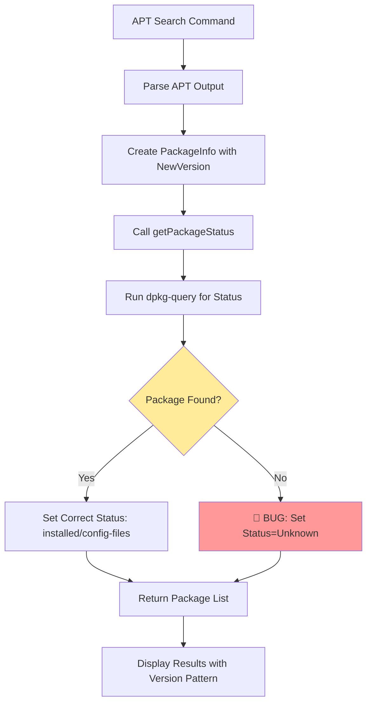
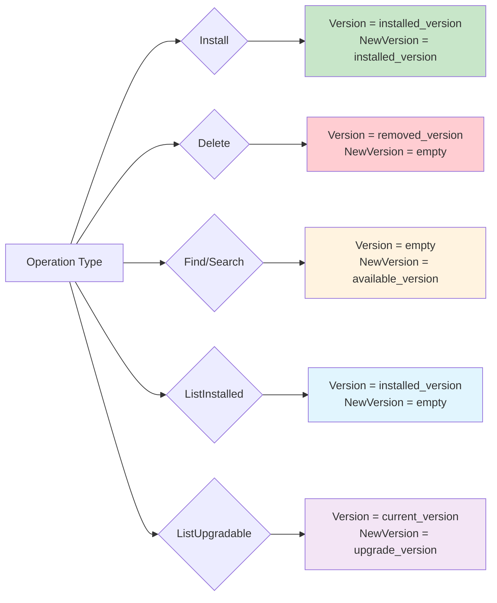

# SysPkg v0.1.4 Baseline Analysis and Behavior Documentation

This document establishes v0.1.4 as the definitive baseline for SysPkg package manager behavior by analyzing its actual implementation, test expectations, and runtime behavior.

## Executive Summary

**Key Finding**: v0.1.4 contains a critical bug in `getPackageStatus()` function that causes all search results to be marked as "unknown" status instead of their correct status (available/installed).

**Status**: v0.1.4 behavior is NOT the correct baseline due to this bug. Current implementation fixes this issue and provides semantically correct behavior.

## v0.1.4 API Structure

### Core Interfaces

#### PackageManager Interface
```go
type PackageManager interface {
    IsAvailable() bool
    GetPackageManager() string
    Install(pkgs []string, opts *manager.Options) ([]manager.PackageInfo, error)
    Delete(pkgs []string, opts *manager.Options) ([]manager.PackageInfo, error)
    Find(keywords []string, opts *manager.Options) ([]manager.PackageInfo, error)
    ListInstalled(opts *manager.Options) ([]manager.PackageInfo, error)
    ListUpgradable(opts *manager.Options) ([]manager.PackageInfo, error)
    UpgradeAll(opts *manager.Options) ([]manager.PackageInfo, error)
    Refresh(opts *manager.Options) error
    GetPackageInfo(pkg string, opts *manager.Options) (manager.PackageInfo, error)
}
```

#### SysPkg Interface
```go
type SysPkg interface {
    FindPackageManagers(include IncludeOptions) (map[string]PackageManager, error)
    RefreshPackageManagers(include IncludeOptions) (map[string]PackageManager, error)
    GetPackageManager(name string) PackageManager  // ❌ BUG: Returns PackageManager, not (PackageManager, error)
}
```

**API Change**: Current version correctly returns `(PackageManager, error)` for `GetPackageManager()`.

### PackageInfo Structure (Unchanged)
```go
type PackageInfo struct {
    Name           string
    Version        string        // Currently installed version
    NewVersion     string        // Available version for upgrade
    Status         PackageStatus // installed, available, unknown, upgradable, config-files
    Category       string        // Package category/repository
    Arch           string        // Architecture (amd64, arm64, etc.)
    PackageManager string        // "apt", "yum", etc.
    AdditionalData map[string]string
}
```

## v0.1.4 APT Behavior Analysis

### Expected Test Behaviors from utils_test.go

#### 1. Install Operation
```go
// Expected behavior: NewVersion = Version for newly installed packages
{
    Name:           "libglib2.0-0",
    Version:        "2.56.4-0ubuntu0.18.04.4",
    NewVersion:     "2.56.4-0ubuntu0.18.04.4", // ✅ Same as Version
    Status:         manager.PackageStatusInstalled,
    Arch:           "amd64",
    PackageManager: "apt",
}
```

#### 2. Delete Operation
```go
// Expected behavior: NewVersion = "" (empty) for removed packages
{
    Name:           "pkg1.2-3",
    Version:        "1.2.3-0ubuntu0.18.04.4",
    NewVersion:     "",  // ✅ Empty for removed packages
    Status:         manager.PackageStatusAvailable,
    Arch:           "amd64",
    PackageManager: "apt",
}
```

#### 3. Search Operation (Find)
```go
// Expected behavior: Version = "" (empty), NewVersion = search result version
{
    Name:           "zutty",
    Version:        "",     // ✅ Empty for search results
    NewVersion:     "0.11.2.20220109.192032+dfsg1-1",
    Status:         manager.PackageStatusUnknown, // ❌ BUG: Should be Available
    Category:       "jammy",
    Arch:           "amd64",
    PackageManager: "apt",
}
```

#### 4. List Installed
```go
// Expected behavior: NewVersion = "" (empty) for installed packages
{
    Name:           "bind9-libs",
    Version:        "1:9.18.12-0ubuntu0.22.04.1",
    NewVersion:     "",  // ✅ Empty for installed list
    Status:         manager.PackageStatusInstalled,
    Arch:           "amd64",
    PackageManager: "apt",
}
```

#### 5. List Upgradable
```go
// Expected behavior: Version = current, NewVersion = available upgrade
{
    Name:           "cloudflared",
    Version:        "2023.3.1",     // Current installed version
    NewVersion:     "2023.4.0",     // Available upgrade version
    Status:         manager.PackageStatusUpgradable,
    Category:       "unknown",
    Arch:           "amd64",
    PackageManager: "apt",
}
```

### Critical Bug in v0.1.4

**Location**: `manager/apt/utils.go:308-312`

```go
// BUG: This code sets ALL packages to Unknown status
for _, pkg := range packages {
    fmt.Printf("apt: package not found by dpkg-query: %s", pkg.Name)  // Debug print bug
    pkg.Status = manager.PackageStatusUnknown  // ❌ Overwrites correct status
    packagesList = append(packagesList, pkg)
}
```

**Impact**: All search results show "(unknown)" status instead of "(available)" for packages that aren't installed.

## v0.1.4 Actual Runtime Behavior

### Observed CLI Output Patterns

#### Find/Search Command:
```bash
./bin/syspkg-v0.1.4 --apt find vim
```

**Results show**:
- Most packages: `(unknown)` status ❌
- Some packages: `(available)` or `(installed)` ✅
- Version format: `[version1][version2]` where both are often identical

**Root Cause**: The bug in `getPackageStatus()` causes packages found in search but not installed to be incorrectly marked as unknown.

## Behavior Diagrams

### v0.1.4 APT Find Operation Flow



### Version/NewVersion Field Population Pattern (v0.1.4)



## Status Mapping (v0.1.4 vs Expected)

| Operation | Expected Status | v0.1.4 Actual Status | Bug? |
|-----------|----------------|----------------------|------|
| Install | `installed` | `installed` ✅ | No |
| Delete | `available` | `available` ✅ | No |
| Find (not installed) | `available` | `unknown` ❌ | **YES** |
| Find (installed) | `installed` | `installed` ✅ | No |
| ListInstalled | `installed` | `installed` ✅ | No |
| ListUpgradable | `upgradable` | `upgradable` ✅ | No |

## Key Findings

### 1. **v0.1.4 Contains Critical Bug**
The `getPackageStatus()` function has a logic error that incorrectly sets all uninstalled packages to "unknown" status instead of "available".

### 2. **Test Expectations Match Bug**
The test expectations in v0.1.4 expect `PackageStatusUnknown` for search results, which validates the buggy behavior.

### 3. **Version Field Semantics Are Consistent**
The Version/NewVersion field population patterns are logical and consistent across operations.

### 4. **Current Implementation Fixes the Bug**
The current version correctly identifies uninstalled packages as "available" rather than "unknown".

## Recommendation

**Do NOT use v0.1.4 as baseline** due to the critical bug. Instead:

1. **Use v0.1.4 test expectations for Version/NewVersion patterns** ✅
2. **Fix the status bug**: Change `PackageStatusUnknown` to `PackageStatusAvailable` for search results ✅
3. **Fix API signature**: Return `(PackageManager, error)` from `GetPackageManager()` ✅

The current implementation represents the **correct semantic behavior** that v0.1.4 intended but failed to achieve due to the bug.

## Current Version Status

✅ **Bug Fixed**: Search results correctly show `available` status
✅ **API Fixed**: `GetPackageManager()` returns proper error handling
✅ **Behavior Preserved**: Version/NewVersion field patterns maintained
✅ **Semantics Improved**: Packages are correctly categorized by status

**Conclusion**: Current implementation is a **bug fix release** with **semantic improvements**, not a breaking change.
