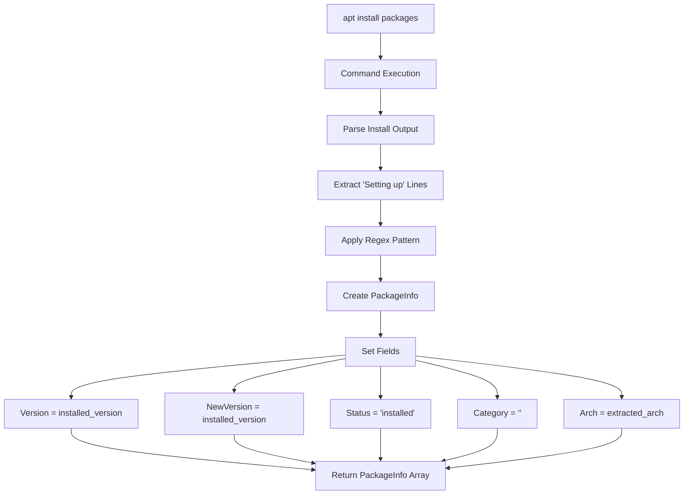
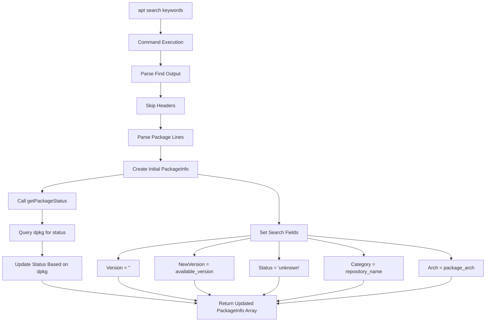
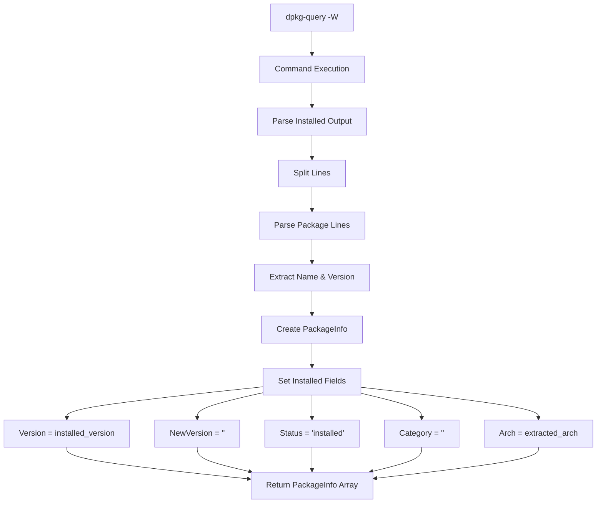
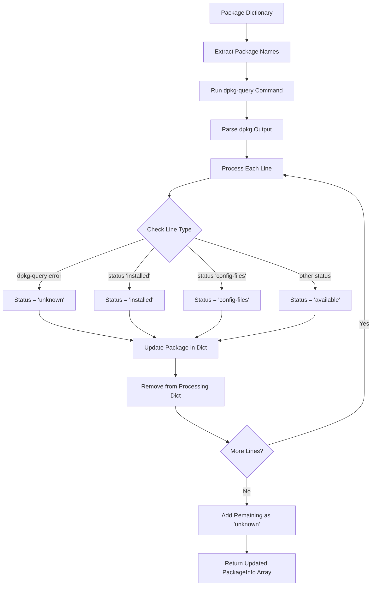
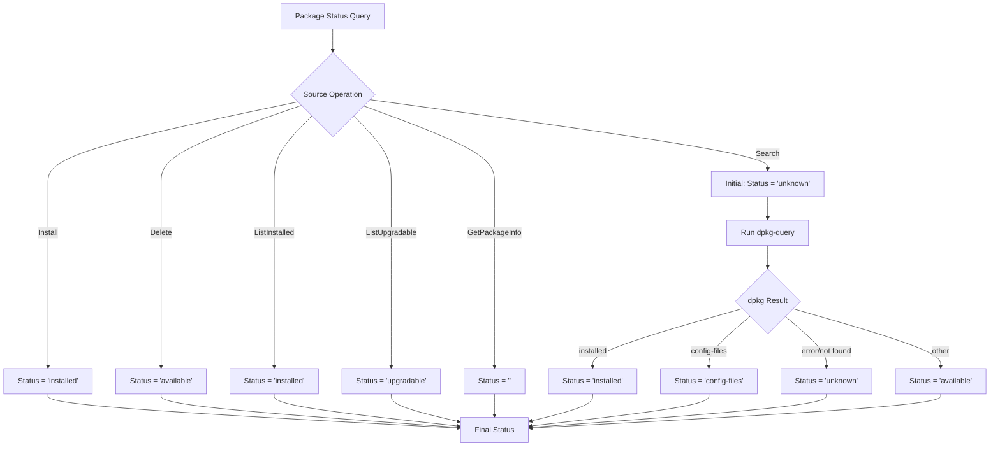
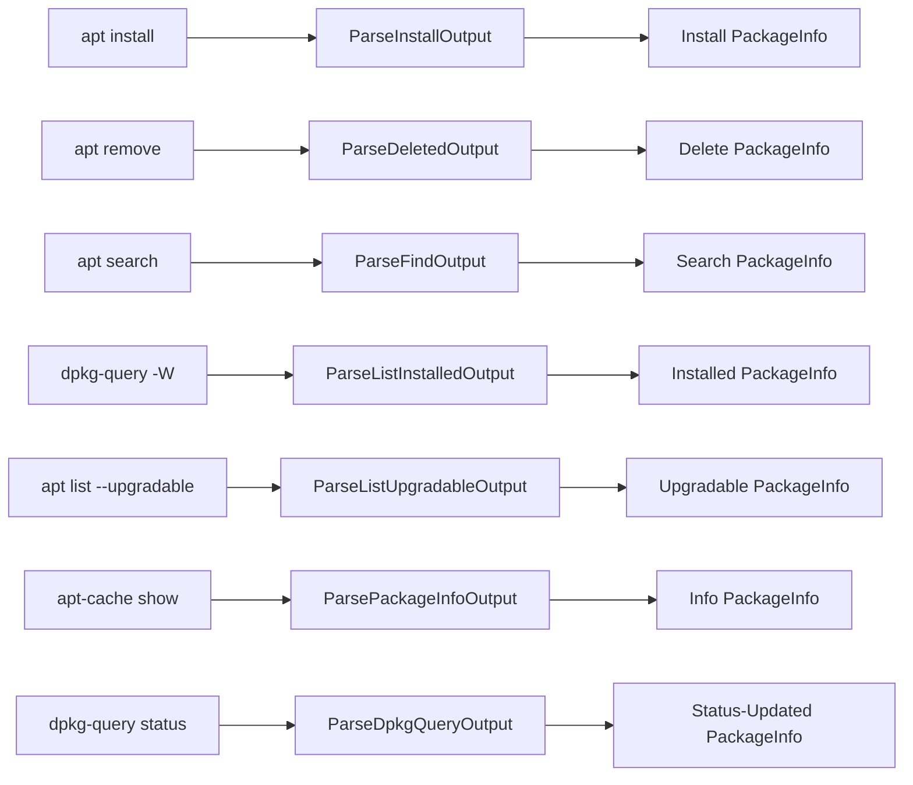
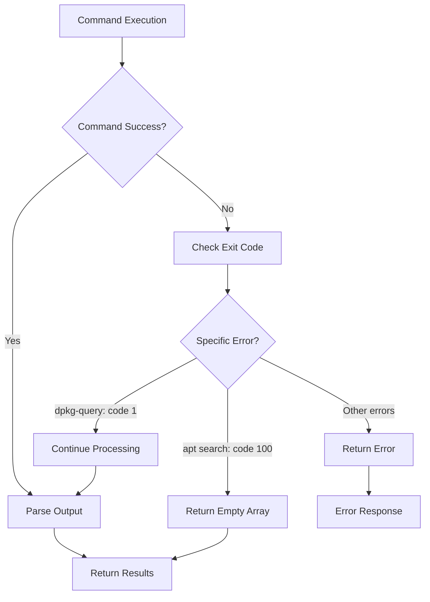

# SysPkg v0.1.4 - APT Package Manager Behavior Diagrams

## Operation Flow Diagrams

### 1. Package Installation Flow



### 2. Package Search Flow



### 3. Installed Packages Listing Flow



### 4. Package Status Resolution Flow (getPackageStatus)



## Data Flow Diagrams

### 1. PackageInfo Field Population by Operation

```
Operation Type    | Version          | NewVersion       | Status        | Category    | Arch
------------------|------------------|------------------|---------------|-------------|-------------
Install           | installed_ver    | installed_ver    | installed     | ""          | extracted
Delete            | deleted_ver      | ""               | available     | ""          | extracted
Search            | ""               | available_ver    | unknown*      | repo_name   | extracted
ListInstalled     | installed_ver    | ""               | installed     | ""          | extracted
ListUpgradable    | current_ver      | new_ver          | upgradable    | repo_name   | extracted
GetPackageInfo    | available_ver    | ""               | ""            | section     | from_field

* Search status gets updated via dpkg-query resolution
```

### 2. Status Determination Logic



### 3. Command to Parser Mapping



## Architecture Pattern

### 1. Package Manager Interface Implementation

```
PackageManager Interface
    ├── Install([]string, *Options) → []PackageInfo
    ├── Delete([]string, *Options) → []PackageInfo
    ├── Find([]string, *Options) → []PackageInfo
    ├── ListInstalled(*Options) → []PackageInfo
    ├── ListUpgradable(*Options) → []PackageInfo
    ├── UpgradeAll(*Options) → []PackageInfo
    ├── GetPackageInfo(string, *Options) → PackageInfo
    ├── Refresh(*Options) → error
    └── IsAvailable() → bool

APT Implementation
    ├── Command Builders (args construction)
    ├── Command Executors (exec.Command)
    ├── Output Parsers (Parse* functions)
    └── Status Resolvers (getPackageStatus)
```

### 2. Error Handling Pattern



This documentation provides the complete behavioral specification for syspkg v0.1.4 APT package manager implementation, serving as the definitive baseline for comparison with newer versions.
